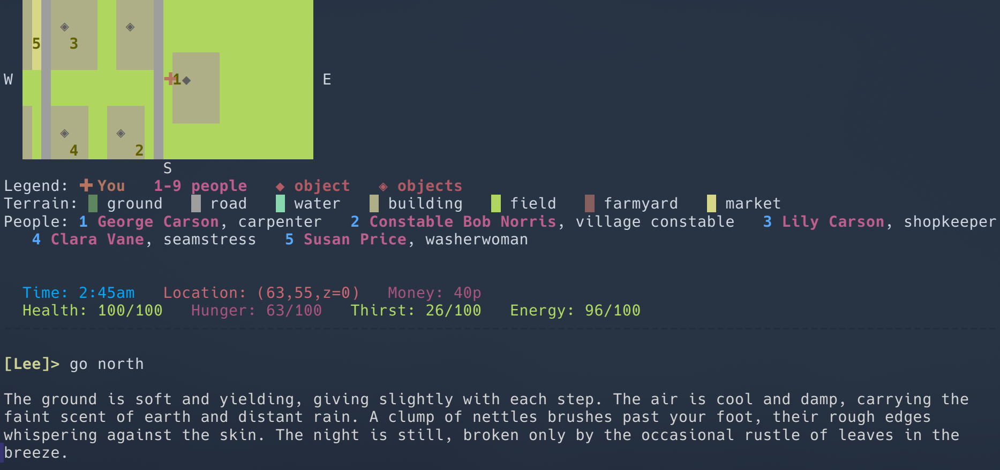

# Millhaven

A text adventure set in a quiet English village, driven by a local LLM.



## Requirements

- Python 3.9+
- An LLM — either via [Ollama](https://ollama.ai) or an embedded model (see below)

## Quick start

```bash
pip install -r requirements.txt

# Create your local config (gitignored — safe to put tokens here)
cp config.example.py config.py

# Generate the world (run once)
python init_town.py

# Play
python main.py
```

On first run, `main.py` looks for Ollama. If it isn't running it falls back to
the embedded model mode automatically.

---

## LLM backends

### Option A — Ollama (default if running)

Install [Ollama](https://ollama.ai), pull a model, and the game will use it
automatically:

```bash
ollama pull qwen2.5:14b
```

To use a different model, set `OLLAMA_MODEL` in `config.py`. Smaller models
such as `qwen2.5:7b` or `llama3.2:3b` run faster but produce less nuanced
narrative.

### Option B — Embedded model (no Ollama needed)

The embedded backend runs a GGUF model in-process via
[llama-cpp-python](https://github.com/abetlen/llama-cpp-python). Install it
with the pre-built CPU wheels to avoid a C++ compilation step:

```bash
pip install llama-cpp-python \
  --extra-index-url https://abetlen.github.io/llama-cpp-python/whl/cpu
```

Then point the game at a model file. **The simplest approach is to use a file
you already have** — anything downloaded by Ollama, LM Studio, or a direct
browser download will work:

```python
# config.py
EMBEDDED_MODEL_PATH = "/path/to/your-model-Q4_K_M.gguf"
```

If `EMBEDDED_MODEL_PATH` is left empty, the game will attempt to download
[Qwen3-4B-Instruct-Q4_K_M](https://huggingface.co/bartowski/Qwen3-4B-Instruct-GGUF)
(~2.5 GB) from HuggingFace on first run. This may require a free HuggingFace
account and accepting the model licence — if you get a 401 error, see the
note in `config.py`.

**Default model:** Qwen3 1.7B Q4_K_M (~1.1 GB, ~2 GB RAM). Fast on most
hardware. For stronger narrative at the cost of speed, point
`EMBEDDED_MODEL_PATH` at a 4B or 7B GGUF instead.

### Choosing a backend

Set `LLM_BACKEND` in `config.py`:

| Value | Behaviour |
|---|---|
| `"auto"` | Tries Ollama first, falls back to embedded (default) |
| `"ollama"` | Ollama only — fails if not running |
| `"embedded"` | Embedded only — ignores Ollama |

---

## The world

**Millhaven** is a 100×100 grid (10,000 locations). The town occupies roughly
the central 60×60 area; the edges fade into wilderness, farmland and countryside.

- ~23 buildings: inn, bakery, smithy, church, town hall, surgery, school, shops, homes, two farms
- 24 characters with personalities, occupations, needs and home locations
- 200+ physical objects across the world
- Pseudo-2D: most locations are ground level (z=0); some buildings have upper
  floors (z=1) or cellars (z=-1)

## Commands

Type naturally — the LLM interprets your intent. Examples:

```
north / south / east / west / up / down
look around
examine the anvil
take the bread roll
say "Good morning"
ask James about rooms
give the coin to the beggar
buy a loaf
eat the apple
sleep
wait
inventory  (or just: i)
status
help
quit
```

## Emergent gameplay

There is no fixed plot, but needs create pressure:

- **Hunger** rises each turn — find food or buy it
- **Energy** falls — find somewhere to sleep
- Characters react to what you say and do
- NPCs move, have their own schedules and moods
- Objects persist; states change; things can be taken, used, given away

Goals might emerge: earn money working odd jobs, find accommodation at the inn,
uncover why Old Peter wanders the square, discover what the wanted poster means.
